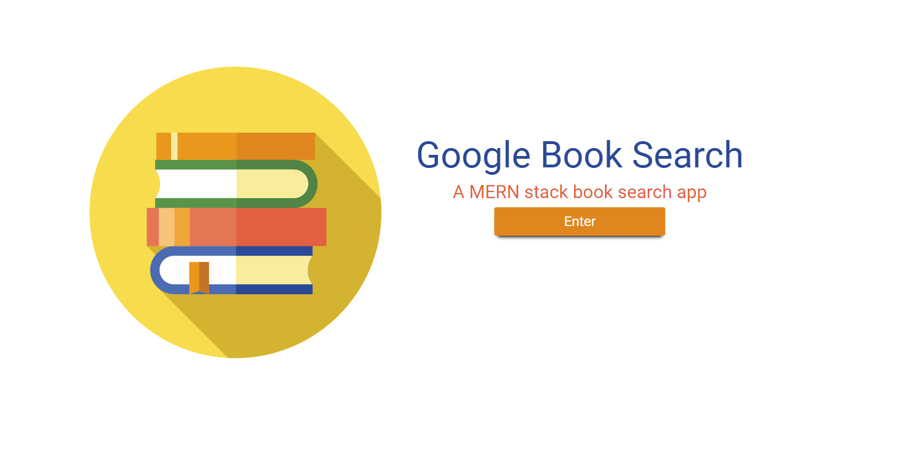
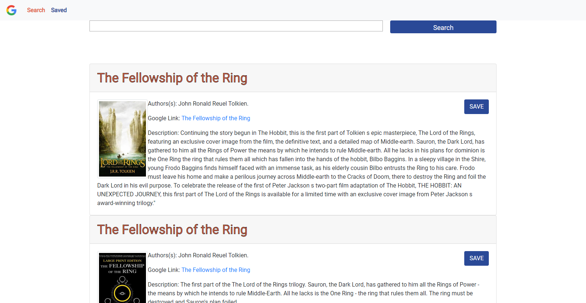

  
  
 

<h1 align="center"> Google Books Search </h1>

<h2 align="center">  A MERN Stack App</h2>

## Overview

This app utilizes Google's book API and allows the user to search for books and save book searches to a mongo database.

## Features

- The user can enter the book title or author information in the search box.

- The results from the Google books API will return in the form of cards

- The card will display the title, author or authors, description, image of the book cover and a link to google play store if the book is available there.

- The user can save book search result in order to review for reading at a later time.

## Core Technologies

**Front End:**

- React
- Bootstrap
- Axios

**Back End:**

- Node.js
- Express.js
- MongoDB

**Deployment:**

- Heroku

## Deployment Link

<a href="https://arcane-scrubland-22228.herokuapp.com/" target="_blank">Google Books Search App</a>
